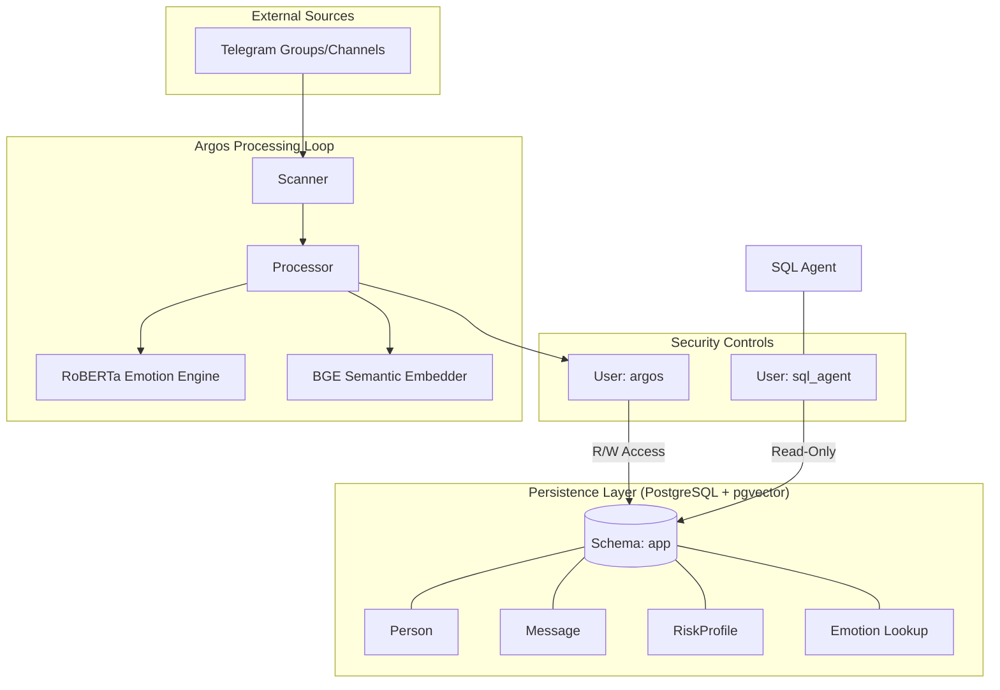

# 🛡️ Argos System: AI-Driven Security & Risk Analysis

The **Argos System** is a toolset for the scraping, emotional classification, and semantic analysis of Telegram messages. It uses NLP models and a vector-enabled PostgreSQL database to track sentiment trends and identify potential risks across monitored channels.


---

## 📊 Features

- **Automated Ingestion**: Message scraping via **Telethon** with:
    - **Incremental tracking**: Fetches new messages using `min_id` offsets.
    - **Topic filtering**: Supports filtering by Telegram topic / reply-to IDs.
    - **Media handling**: Automated exclusion of messages without text to reduce processing load.
    - **Entity normalization**: Standardizes User, Channel, and Chat data into a unified schema.
- **Emotion Classification**: Emotional analysis using a **RoBERTa** model (GoEmotions) to track states such as *anger*, *fear*, and *remorse*.
- **Semantic Risk Scoring**: Evaluation of message intent against 8 threat domains:
    1.  **Ideological Radicalization**: Detecting extremist rhetoric.
    2.  **Tactical Planning & Weaponry**: Identifying IED and chemical discussions.
    3.  **Incitement to Violence**: Detecting coordination of physical attacks.
    4.  **Terrorist Financing**: Identifying cryptocurrency and laundering intent.
    5.  **Operational Security Evasion**: Detecting burner phones and SIM destruction.
    6.  **Cyber Attacks & Hacking**: Flagging DDoS and exploit coordination.
    7.  **Human Trafficking & Exploitation**: Identifying illicit transport topics.
    8.  **Drug Manufacturing & Distribution**: Spotting precursor chemical procurement.
    *Scores are clamped at 5.0 and calculated on-demand via the CLI.*

- **Semantic Search**: **pgvector** integration for content retrieval using cosine distance.
- **Text-to-SQL Interface**: Query the database in natural language using **GPT-4o** and **LangChain**:
    - **Schema Constraints**: Enforces singular table names and existing columns to reduce hallucinations.
    - **Role Isolation**: Executes via a read-only database user (`sql_agent`) with no write permissions.


### 🤖 Bot Lifecycle & Orchestration

The system follows a execution cycle managed by the `Bot` class:
1.  **Authentication**: Uses `core/client_factory.py` to manage Telegram sessions.
2.  **Initial History Sync**: Scrapes historical messages to establish a baseline.
3.  **Periodic Evaluation Loop**:
    *   **Phase A (Ingest)**: Scans for new messages using `min_id` increments.
    *   **Phase B (Inference)**: Runs emotion classification and vector encoding.
    *   **Phase C (Enrichment)**: Updates the per-person emotional trend in the database.
4.  **Error Handling**: Logging and recovery for individual message processing failures.

Note: The risk assessment is not performed during the periodic scraping process to avoid unnecessary model inference load. It is performed on-demand via the interactive CLI.

## 🗄️ Relational & Vector Schema

The system manages five core PostgreSQL tables in the `app` schema:

| Table | Role | Key Attribute |
| :--- | :--- | :--- |
| **`person`** | Identity | Stores stable Telegram User IDs (`BigInteger`). |
| **`message`** | History | Holds textual content and **384-dimensional vectors**. |
| **`emotion`** | Lookup | Master reference for the 28 GoEmotion labels. |
| **`message_emotion`** | Metrics | Confidence scores (0.0 to 1.0) linking emotions to messages. |
| **`risk_profile`** | Analytics | Tracks hierarchical risk scores and behavioral trends. |

Persistence is managed through the **Repository Pattern**, decoupling logical operations from database sessions.

## 🏗️ System Architecture



## 🛠️ Technical Specifications

| Component | Technology | Model / Detail |
| :--- | :--- | :--- |
| **Language** | Python 3.10+ | Asynchronous (asyncio) |
| **ORM / Schema** | [SQLModel](database/models.py) | Pydantic + SQLAlchemy |
| **Database** | PostgreSQL 16+ | With `pgvector` extension |
| **Emotion Analysis** | Transformers | `roberta-base-go_emotions` |
| **Embeddings** | Sentence-Transformers | `BAAI/bge-small-en-v1.5` |
| **Inference Mode** | Threaded Async | Non-blocking via `executor` |
| **NLP Chain** | LangChain | Natural Language to SQL |
| **LLM Engine** | OpenAI | GPT-4o (via LangChain) |
| **CLI / UI** | Rich & Questionary | Interactive Dashboard |

### 📟 Interactive Command Interface

The system is controlled via a color-coded CLI menu:

*   **Scrape**: Configure target groups, private chat IDs, and topic-level filters interactively.
*   **Analyze**: Use the **SQL Agent** mode for GPT-4o database queries.
*   **Risk Dashboard**: View a semantic risk scorecard for every person tracked in the database, with color-coded threat levels (🔴 High, 🟡 Medium, 🟢 Low) and primary threat category attribution.
*   **System Status**: Validation of environment credentials and database connectivity.


### 🧠 AI Intelligence & Inference

The system uses NLP models to extract signals from text data:

1.  **Emotion Engine**: A **RoBERTa (GoEmotions)** model classifies messages into discrete emotional states. Inferences are processed in a background thread pool (`ThreadPoolExecutor`) to avoid blocking the main event loop.
2.  **Semantic Engine**: **BGE-small-v1.5** generates 384-dimensional vectors used for content search and risk comparison using cosine similarity.


## 🔒 Security Architecture: Dual-User Model

The database is configured with two distinct user roles to isolate administrative tasks from automated queries:

1.  **Administrative User (`argos`)**:
    *   **Permissions**: Schema owner with full `SELECT`, `INSERT`, `UPDATE`, `DELETE`, and `DDL` rights.
    *   **Usage**: Used for scraping, running model inferences, and updating database records.
2.  **Restricted Agent (`sql_agent`)**:
    *   **Permissions**: Read-only access via `GRANT USAGE` and `GRANT SELECT`.
    *   **Usage**: Used by the natural language query interface. This role cannot modify or delete data, providing a layer of protection at the database level.

Both users have a default `search_path` set to the `app` schema.

## 🚀 Deployment & Installation

### 1. Database Initialization
Run the hardened setup script as a database superuser to initialize schemas, roles, and extension:
```bash
sudo -u postgres psql -f database/create_psql_db.sql
```

### 2. Dependency Management
```bash
pip install -r requirements.txt
```

### 3. Environment Configuration
Fill the `.env` file with your credentials (see `.env.example` for reference).

### 4. Application Execution
```bash
python main.py
```


---
*Disclaimer: This tool is intended for ethical security research.*
