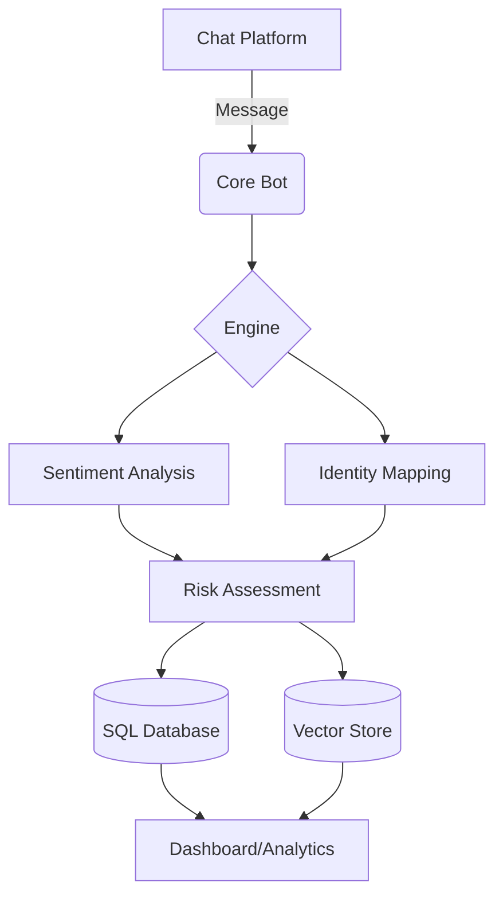

# AI Sentiment & Risk Analysis Bot


## 📊 System Architecture


## 🚀 Features

- **Message Logging**: Automated capture and structured recording of chat history.
- **Identity Management**: Linking messages to specific users for behavioral tracking.
- **Sentiment Analysis**: Real-time sentiment scoring of interactions.
- **Risk Assessment**: Classification of users based on custom risk profiles (e.g., behavioral, security, or compliance).
- **Semantic Embeddings**: Storing message context mathematically in a vector database for advanced semantic retrieval.

## 📂 Project Structure

```text
├── core/               # Bot connectivity and orchestration
├── modules/            # Domain-specific logic
│   ├── identity.py     # User and person management
│   ├── recording.py    # Message recording logic
│   ├── risk_assessment.py # Risk profiling
│   ├── sentiment_analysis.py # NLP sentiment scoring
│   └── semantic_embeddings.py # Vector embedding generation
├── database/           # Relational and vector storage interfaces
├── config/             # Project configuration and constants
├── utils/              # Shared utilities (logging, helpers)
├── tests/              # Comprehensive test suite
└── assets/             # Storage for logs and exports (git-ignored)
```

## 🛠️ Tech Stack

- **Laguage**: Python 3.10+
- **LLM / AI**: OpenAI API / LangChain
- **NLP**: Transformers / NLTK
- **Storage**: SQLAlchemy (SQL) / ChromaDB (Vector)
- **Validation**: Pydantic

## ⚙️ Setup

1. **Clone the repository**:
   ```bash
   git clone <your-repository-url>
   cd ai-sentiment-risk-bot
   ```

2. **Install dependencies**:
   ```bash
   pip install -r requirements.txt
   ```

3. **Environment Setup**:
   Copy the example environment file and fill in your credentials:
   ```bash
   cp .env.example .env
   # Edit .env with your API keys
   ```

4. **Run the Bot**:
   ```bash
   python main.py
   ```

## 📜 License

Distributed under the MIT License. See `LICENSE` for more information.
